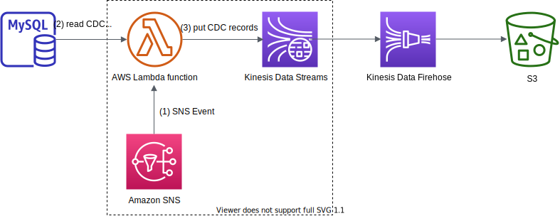

# Description
AWS Lamba를 이용해서 MySQL에서 CDC(Change Data Capture)를 Kinesis Data Streams로 전송하는 lambda function



# How it works
Amazon SNS 이벤트 -> Lambda Function 에서 RDS 데이터 덤프 -> Kinesis Data Streams

(1) 다음과 같은 메시지 내용이 담긴 Amazon SNS를 AWS Lambda function에 보낸다.
```json
{
  "db_host": "'cdc-test.rds.amazonaws.com",
  "db_user": "db_user",
  "db_password": "db_password",
  "database": "test",
  "table": "pet",
  "columns": "name, owner, species, sex, DATE_FORMAT(birth, '%Y-%m-%d') AS birth",
  "where_clause": "c_time >= '2020-06-05 13:23:00' and c_time < '2020-06-05 13:24:00'",
  "primary_column": "pkid",
  "kinesis_max_put_records": 100
}
```

예를 들어, `mysql_cdc` 라는 AWS SNS topic에 boto3 라이브러리를 이용해서 SNS를 아래와 같으 보낼 수 있다. 
```shell script
$ python
Python 3.6.9 (default, Apr 18 2020, 01:56:04)
[GCC 8.4.0] on linux
Type "help", "copyright", "credits" or "license" for more information.
>>> import boto3
>>> import json
>>>
>>> rds_cdc_query = {
...   "db_host": "cdc-test.rds.amazonaws.com",
...   "db_user": "db_user",
...   "db_password": "db_password",
...   "database": "test",
...   "table": "pet",
...   "columns": "name, owner, species, sex, DATE_FORMAT(birth, '%Y-%m-%d') AS birth",
...   "where_clause": "c_time >= '2020-06-06 13:23:00' AND c_time < '2020-06-06 13:24:00'",
...   "primary_column": "pkid",
...   "kinesis_max_put_records": 100
... }
>>> msg = json.dumps(rds_cdc_query)
>>> type(msg)
<class 'str'>
>>>
>>> sns_client = boto3.client('sns', region_name='us-east-1')
>>> sns_client.publish(
...     TopicArn='arn:aws:sns:us-east-1:123456789012:mysql_cdc',
...     Message=msg,
...     Subject='CDC from test.pet'
... )
{'MessageId': 'd17d598f-7288-5aca-931b-0ed93f3ff836', 'ResponseMetadata': {'RequestId': '4e1adbb6-881f-567f-a711-8ce0c5a8c483', 'HTTPStatusCode': 200, 'HTTPHeaders': {'x-amzn-requestid': '4e1adbb6-881f-567f-a711-8ce0c5a8c483', 'content-type': 'text/xml', 'content-length': '294', 'date': 'Sun, 07 Jun 2020 02:05:43 GMT'}, 'RetryAttempts': 0}}
>>>
```

(2) AWS Lambda function에서 SNS 메시지를 내용을 바탕으로 아래와 같은 쿼리를 실행하고,
  실생 결과를 Kinesis Data Streams에 전송 한다.
```shell script
SELECT name, owner, species, sex, DATE_FORMAT(birth, '%Y-%m-%d') AS birth
FROM test.pet
WHERE c_time >= '2020-06-06 13:23:00' and c_time < '2020-06-06 13:24:00'
```

# Deployment
(1) Amazon SNS topic을 생성한다.
(2) [AWS Lambda Layer](https://docs.aws.amazon.com/lambda/latest/dg/configuration-layers.html)에 [dataset](https://dataset.readthedocs.io/en/latest/index.html), [pymysql](https://pymysql.readthedocs.io/en/latest/) 패키지를 각각 등록 한다.
* [dataset](https://dataset.readthedocs.io/en/latest/index.html) - toolkit for Python-based database access
* [pymysql](https://pymysql.readthedocs.io/en/latest/) - a pure-Python MySQL client library
* AWS Lambda Layer에 등록할 Python 패키지 생성 예제: dataset
```shell script
$ python3 -m venv dataset-lib # virtual environments을 생성함
$ cd dataset-lib
$ source bin/activate
$ mkdir -p python_modules # 필요한 패키지를 저장할 디렉터리 생성
$ pip install dataset -t python_modules # 필요한 패키지를 사용자가 지정한 패키지 디렉터리에 저장함
$ mv python_modules python # 사용자가 지정한 패키지 디렉터리 이름을 python으로 변경함 (python 디렉터리에 패키지를 설치할 경우 에러가 나기 때문에 다른 이름의 디렉터리에 패키지를 설치 후, 디렉터리 이름을 변경함)
$ zip -r dataset-lib.zip python/ # 필요한 패키지가 설치된 디렉터리를 압축함
$ aws s3 cp dataset-lib.zip s3://my-lambda-layer-packages/python/ # 압축한 패키지를 s3에 업로드 한 후, lambda layer에 패키지를 등록할 때, s3 위치를 등록하면 됨
```
(3) Step 1에서 생성한 Amazon SNS 이벤트에 의해서 trigger 되는 AWS Lambda function을 생성한다.
lambda function 코드는 `src/main/python/LoadCDCfromRDStoKinesis` 디렉터리에 있는 코드를 참고해서 생성한다.

# Test
(1) RDS에 접속한 후, 다음과 같은 테스트용 database 생성 한다.
```shell script
$ mycli -u<user_id> -p'<password>' -h <rds host name>
Version: 1.8.1
Chat: https://gitter.im/dbcli/mycli
Mail: https://groups.google.com/forum/#!forum/mycli-users
Home: http://mycli.net
Thanks to the contributor - Ted Pennings
mysql>
mysql> create database test;
mysql> use test;
mysql>

CREATE TABLE pet (
  pkid INT NOT NULL AUTO_INCREMENT,
  name VARCHAR(20),
  owner VARCHAR(20),
  species VARCHAR(20),
  sex CHAR(1),
  birth DATE,
  death DATE,
  c_time DATETIME DEFAULT CURRENT_TIMESTAMP,
  m_time DATETIME DEFAULT CURRENT_TIMESTAMP ON UPDATE CURRENT_TIMESTAMP,

  PRIMARY KEY (pkid),
  KEY (c_time),
  KEY (m_time)
) ENGINE=InnoDB AUTO_INCREMENT=0;

mysql>
INSERT INTO test.pet (name, `owner`, species, sex, birth, death) VALUES
("Fluffy", "Harold", "cat", "f", "1993-02-04", NULL),
("Claws", "Gwen", "cat", "m", "1904-03-17", NULL),
("Buffy", "Harold", "dog", "f", "1989-05-13", NULL),
("Fang", "Benny", "dog", "m", "1990-08-27", NULL),
("Bowser", "Diane", "dog", "m", "1979-08-31", "1995-07-29"),
("Chirpy", "Gwen", "bird", "f", "1998-09-11", NULL),
("Whistler", "Gwen", "bird", NULL, "1997-12-09", NULL),
("Slim", "Benny", "snake", "m", "1996-04-29", NULL);
```

(2) 소스 코드를 git cloen 한 후에, 개발 환경 디렉터리(에: lambda-cdc-to-kinesis)를 생성 한다.
```shell script
$ python3 -m venv lambda-cdc-to-kinesis
$ cd ./lambda-cdc-to-kinesis
$ source ./bin/activate
$ pip install -r requirements.txt
```

(3) 다음과 같이 환경변수 `DRY_RUN=true` 설정 한 후, AWS Lambda function 핸들러 함수를 실행해서 결과를 확인하다.
```shell script
$ cd ./src/main/python/LoadCDCfromRDStoKinesis
$ DRY_RUN=true python3 load_cdc_from_rds_to_kinesis.py
```
